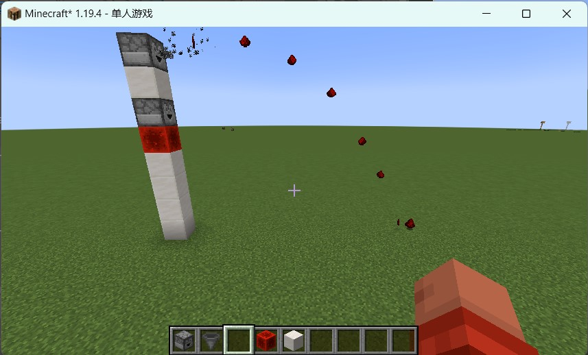
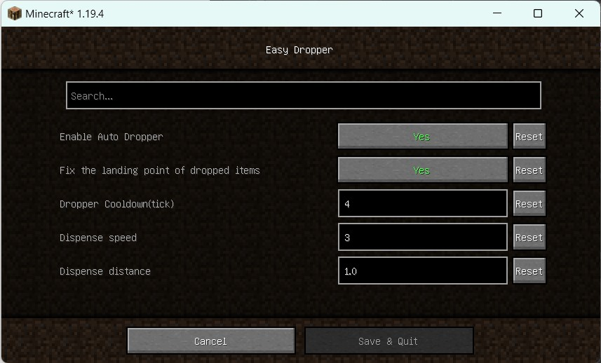
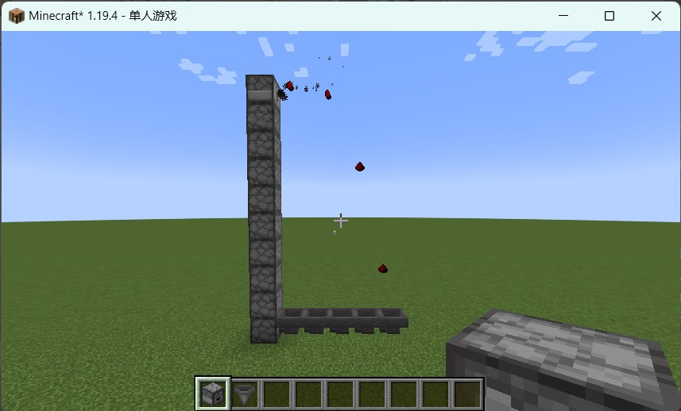

## Easy Dropper

When Droppers contain items, they will automatically dispense. Unless they are powered by redstone.

You can modify the trajectory of the dispensed items to make them land in a fixed position.

## Dependencies

``modmenu``(Only Client)

**Important**:

If this mod is installed on a client, not a server, it is recommended to install ``modmenu``, or you will not see the configuration screen.

## Download

[Get It From CurseForge](https://www.curseforge.com/minecraft/mc-mods/easydropper)

## Features

### Automatic Dropper

The dropper will periodically dispense item if it has. The dispensing frequency can be customized by modifying the cooldown.

**Redstone power will stop it!(Like Hopper).**

### Fix landing point

When enabled, the landing position of each item are no longer random. They are accurately calculated based on the value specified by players.

## Tips

You can use droppers to transfer items upwards from below.

