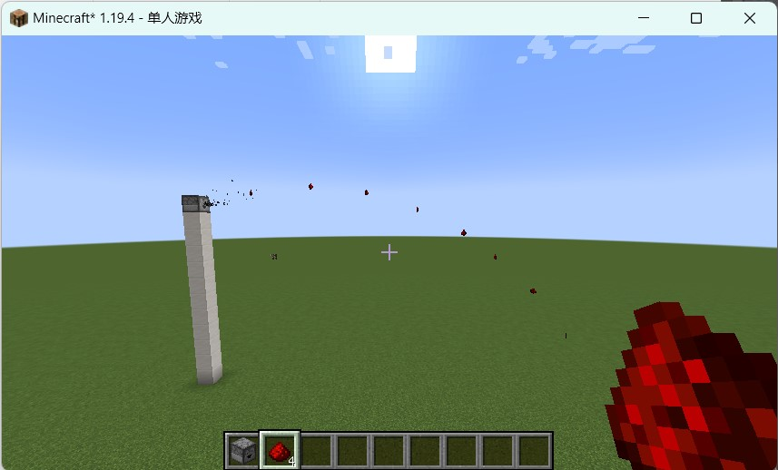

## Easy Dropper

Easy Dropper supports the automatic launching of droppers when they contain items, as well as modifying the trajectory of the launched items to make them land in a fixed position.

## Download

Easy Dropper is still under development. You can get the alpha version from:

[Gitee](https://gitee.com/EasyMod/EasyDropper/releases/)

[GitHub](https://github.com/DearXuan7392/EasyDropper/releases/)

## Features

### Automatic Dropper

When enabled, the dropper will periodically dispense item if it has. The dispense frequency can be customized by modifying the cooldown.

But the automatic launching behavior of the dropper cannot be stopped now. I'm trying to fix it.

### Fix landing point

When enabled, the landing position of each item are no longer random. They are accurately calculated based on the value specified by players.

## Dependencies

``minecraft 1.19.4``

``fabric >=0.14.19``

``modmenu >=6.2.1``

``modmenu`` can be downloaded at the following link

[https://modrinth.com/mod/modmenu/versions](https://modrinth.com/mod/modmenu/versions)

> Easy Hopper is only for client and LAN multiplayer. Only the host needs to install it.
