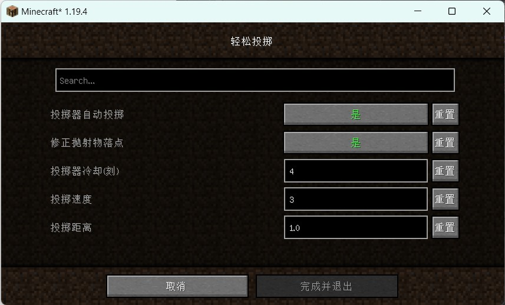

## Easy Dropper

此 MOD 控制投掷器在含有物品时自动发射,以及修改被发射物品的运动曲线,使其每次落在固定的位置.

它在服务器上也能运行,但你需要前往``config``文件夹中手动修改配置文件.

## 依赖

``modmenu``(仅客户端)

**重要**:

如果此Mod被安装在客户端上,则你最好安装``modmenu``. 否则不会显示配置界面,你只能前往``config``文件夹中手动修改配置文件.

## 下载

[前往 CurseForge](https://www.curseforge.com/minecraft/mc-mods/easydropper)

[MC百科](https://www.mcmod.cn/class/10443.html)

## 功能说明

### 自动投掷

启用后,投掷器会定时检查自己是否含有物品(就像漏斗那样).如果有,则立即将其投掷出去.通过修改冷却时间可以自定义投掷频率.

当投掷器被红石电路充能时,投掷会停止.

### 修正落点

启用后,物品的落点不再随机,而是通过用户指定的值来精准计算.

## 小技巧

你可以使用投掷器将物品垂直向上传递,这在下界非常好用!

