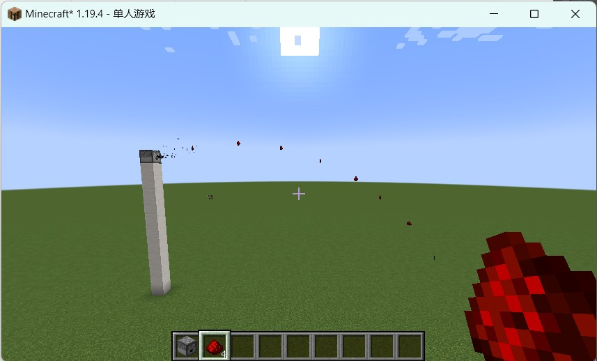

## Easy Dropper

此 MOD 支持投掷器在含有物品时自动发射,以及修改被发射物品的运动曲线,使其每次落在固定的位置.

## 下载

仍在开发中,仅放出预览版.

[Gitee](https://gitee.com/EasyMod/EasyDropper/releases/)

[GitHub](https://github.com/DearXuan7392/EasyDropper/releases/)

## 功能说明

### 自动投掷

启用后,投掷器会定时检查自己是否含有物品(就像漏斗那样).如果有,则立即将其投掷出去.通过修改冷却时间可以自定义投掷频率.

目前,投掷器的自动投掷行为无法停止.待后续完善后将会放出下载链接.

### 修正落点

启用后,物品的落点不再随机,而是通过用户指定的值来精准计算.

## 小技巧

你可以使用投掷器将物品垂直向上传递,这在下界非常好用!

## 依赖

``minecraft 1.19.4``

``fabric >=0.14.19``

``modmenu >=6.2.1``

其中前置mod``modmenu``可在以下链接下载

[https://modrinth.com/mod/modmenu/versions](https://modrinth.com/mod/modmenu/versions)

仅在客户端上测试通过,服务器不保证有效.